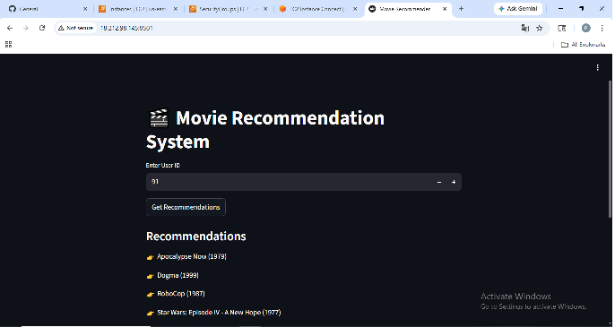
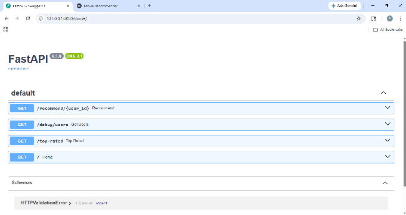
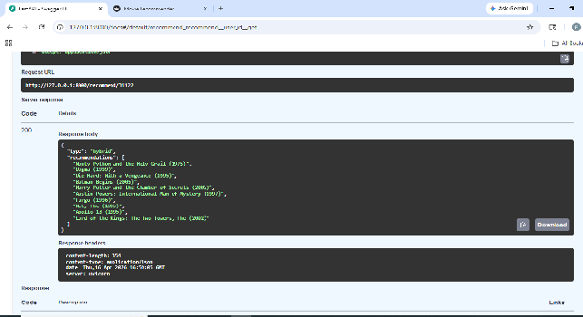

# 🎬 Hybrid Movie Recommendation System

🔗 **Live App:** http://18.212.98.145:8501

A production-ready **Hybrid Recommendation System** that combines **Content-Based Filtering** and **Collaborative Filtering** to deliver personalized movie recommendations.
Deployed using **Docker + AWS EC2** with an interactive **Streamlit frontend** and **FastAPI backend**.

---

## 🎥 Demo Video


> https://github.com/hybrid-recommendation-system/assets/hybridrecmmendationvedio.mp4

---

## 📸 Application Preview


### 🎨 Frontend (Streamlit UI)



### ⚙️ Backend API (FastAPI)



### 🎯 Recommendation Output



---

## 🧠 Features

* 🔍 Content-Based Filtering using TF-IDF
* 🤝 Collaborative Filtering using user-item interactions
* 🔀 Hybrid recommendation combining both approaches
* 📊 Top-rated movies & user-based recommendations
* ⚡ FastAPI backend for scalable inference
* 🎨 Streamlit frontend for interactive UI
* 🐳 Dockerized (separate containers for frontend & backend)
* ☁️ Deployed on AWS EC2

---

## 🏗️ Project Architecture

```
User → Streamlit Frontend → FastAPI Backend → ML Models (.pkl)
```

---

## 📁 Project Structure

```
hybrid-recommendation-system/
│
├── backend/
│   ├── artifacts/          # Trained model files (.pkl)
│   ├── app.py              # FastAPI application
│   ├── train_pipeline.py   # Model training pipeline
│   ├── requirements.txt
│   └── Dockerfile          # Backend container
│
├── frontend/
│   ├── streamlit_app.py    # Streamlit UI
│   └── Dockerfile          # Frontend container
│
├── docker-compose.yml      # Multi-container orchestration
└── README.md
```

---

## ⚙️ Tech Stack

* **Python**
* **Pandas, NumPy, Scikit-learn**
* **TF-IDF Vectorization**
* **FastAPI**
* **Streamlit**
* **Docker & Docker Compose**
* **AWS EC2**

---

## 🧪 How It Works

### 1. Content-Based Filtering

* Uses TF-IDF on movie metadata
* Computes similarity using cosine similarity

### 2. Collaborative Filtering

* Builds user-item interaction matrix
* Learns user preferences from historical ratings

### 3. Hybrid Approach

* Combines both models
* Uses weighted scoring for better recommendations

---

## 📈 Model Performance & Improvements

### 🔻 Baseline Model Performance

Initial hybrid model used a **single seed movie**, resulting in weak personalization:

* Precision@10: **0.091**
* Recall@10: **0.0266**
* MAP@10: **0.0417**
* NDCG@10: **0.0977**

---

### 🚀 Improved Hybrid Model

Enhancements applied:

* Aggregated recommendations from **multiple high-rated user interactions**
* Applied **weighted hybrid scoring**
* Improved ranking quality

---

### ✅ Final Results

* Precision@10: **0.414** 🚀
* Recall@10: **0.111**
* MAP@10: **0.256**
* NDCG@10: **0.409**

---

### 💡 Key Insight

Using multiple user preferences instead of a single seed item significantly improves:

* Recommendation accuracy
* Ranking quality

---

## 🛠️ Installation & Setup

### 🔹 Clone Repository

```
git clone https://github.com/PavithraRajkumar95/hybrid-recommendation-system.git
cd hybrid-recommendation-system
```

---

### 🔹 Run with Docker

```
docker-compose build --no-cache
docker-compose up
```

---

### 🔹 Access Application

```
http://localhost:8501
```

---

## ☁️ Deployment (AWS EC2)

1. Launch EC2 instance (Ubuntu)
2. Install Docker & Git
3. Clone repository
4. Run:

```
sudo docker-compose up
```

5. Open port **8501** in Security Group
6. Access via:

```
http://<ec2-public-ip>:8501
```

---

## 📊 Model Artifacts

Stored in `backend/artifacts/`:

* `content_model.pkl`
* `collaborative_model.pkl`
* `tfidf.pkl`
* `movies.pkl`
* `ratings.pkl`
* `indices.pkl`
* `valid_users.pkl`

---

## 🔥 Future Improvements

* Store models in AWS S3 instead of GitHub
* Add authentication & user profiles
* Improve recommendation ranking
* Optimize cold start performance

---

## 🤝 Connect With Me

* 💼 LinkedIn: https://www.linkedin.com/in/pavithra-rajkumar1995
* 💻 GitHub: https://github.com/PavithraRajkumar95

---

## ⭐ If you like this project

Give it a star ⭐ and feel free to contribute!

